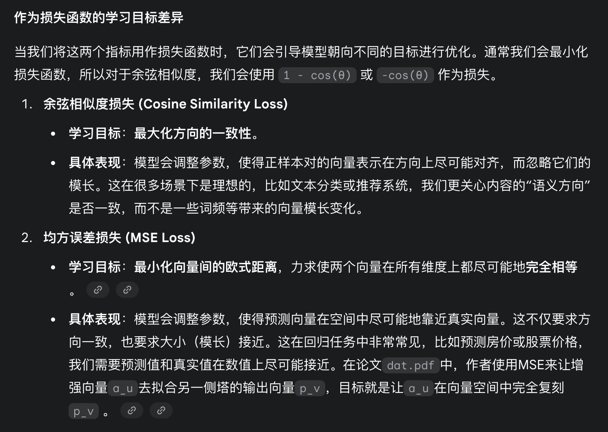
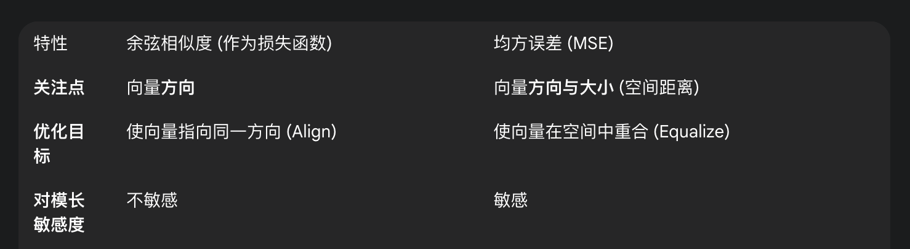
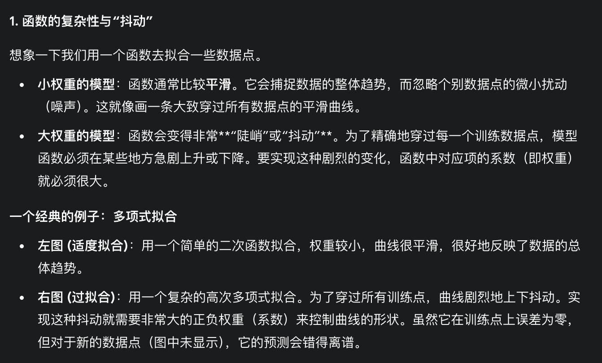
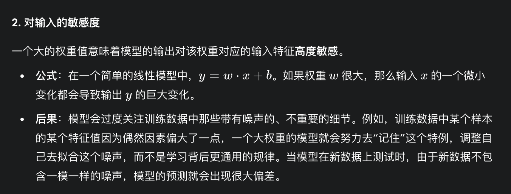

### 美团到店广告算法-召回组
#### 简历拷打
##### 1、你做的辅助向量的loss除了余弦相似度，有没有考虑过对比学习的方法？
“噢 理论上我觉得是可以的，比如说batch 内的其他样本都为负样本，但是我个人觉得可能效果不会特别明显  
“本身这样的对比学习loss作用在主loss上的原因是xxxxxx，但是这要是作用到了训练单个向量上，可能作用会被淹没  
“但是本身这个出发点我是认同的，甚至可以分层多种不同的正样本等级来做对比学习  
##### 2、余弦相似度和你主塔的logloss会不会相互影响？如何看待余弦相似度和交叉熵的不同？
Q1:是的，它们会相互影响。主塔的logloss优化了主向量（pu​,pv），而辅助损失则利用这些优化过的主向量作为“知识源”来优化辅助向量（au,av）。这些优化后的辅助向量反过来又作为输入特征，影响主塔的下一次计算。这种设计形成了一个信息在两个塔之间有效传递和增强的闭环。  
Q2:简单来说，余弦相似度是一个衡量向量方向相似性的度量指标，而交叉熵是一个用于分类问题的损失函数，衡量的是预测概率分布与真实分布的差异。  
余弦相似度：对于已经对齐的向量（例如相似度为0.99），再继续优化的空间很小。它更像一个“排序”目标，只要正样本得分高于负样本即可  
交叉熵：即使一个正样本的预测概率已经很高（如0.9），交叉熵仍然会产生一个非零的损失和梯度，继续推动概率向1.0靠近。它是一个“分类”目标，要求模型做出高置信度的正确判断。  

余弦相似度相比于MSE更注重方向而不是绝对数值，有可能活跃的用户模长很大，低活用户模长很小，当时他们俩兴趣一致，可能方向一致，这时候用余弦相似度更好。并且余弦相似度天然归一化的优势，让loss的学习更稳定。

补充：余弦相似度和MSE的有什么不同之处？

##### 3、你们的embedding是怎么做的？
##### 4、dropout设置参数是多少？除了dropout，还有什么可以缓解过拟合？l1和l2是怎么缓解过拟合的？
没有用到dropout。  
L2和L1原理是一样的，都是通过惩罚权重来使得权重不会过大，导致过拟合。  
补充：为什么权重更大更容易导致过拟合？  
A：

##### 5、是怎么做梯度截断的？有没有截断的阈值？除了梯度截断，还有什么能够避免受梯度影响的办法？
##### 6、你们那是怎么衡量多样性和一致性的？
就是粗排top100在精排top100中的占比。粗排多样性目前用dpp和规则来限制，确实是想先把一致性做上去。
##### 7、你们双塔是共享参数吗？你如何看待两个塔之间共享参数这个做法的？分析一下共享和不共享有什么区别？
不能，输入都不一样，没有意义。
##### 8、不同任务之间的权重如何确定？ctr的权重参数是多少？
我们是直接写死的。ctr的权重是：1.0，其他目标都是0.1  
##### 9、除了双塔，粗排还能用其他的模型吗？例如w&d，dcn之类的？为啥粗排要用双塔？
阿里的cold。
A2:首先双塔模型简单算得快，其次双塔解耦，在离线算好item的emb并存成一个按照item_id检索的查询表，在线上serving的时候可以通过查询向量数据库的形式来快速获取item embedding。
##### 10、你们的交叉特征是怎么做的？在哪里做的？在模型侧没有手动的交叉吗？
我们在推荐引擎端和pyfe做的，pyfe就是b站这可以理解成一个特征仓库，pyfe是flink样本流拼的。
##### 11、如何你的某个目标指标出现问题了，你该如何排查？（跷跷板现象怎么排查问题？）
##### 12、有没有什么缓解表征退化的方法？

#### 二叉树所有根节点到叶子结点的路径之和